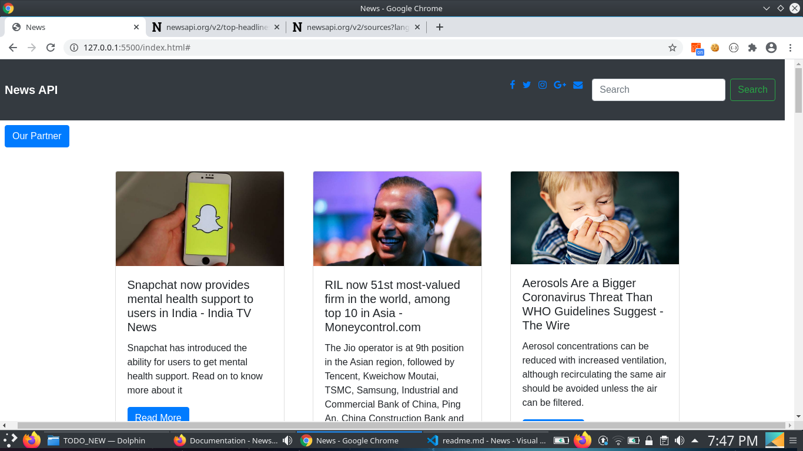
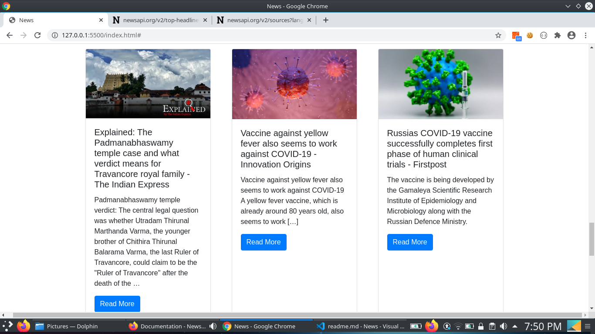
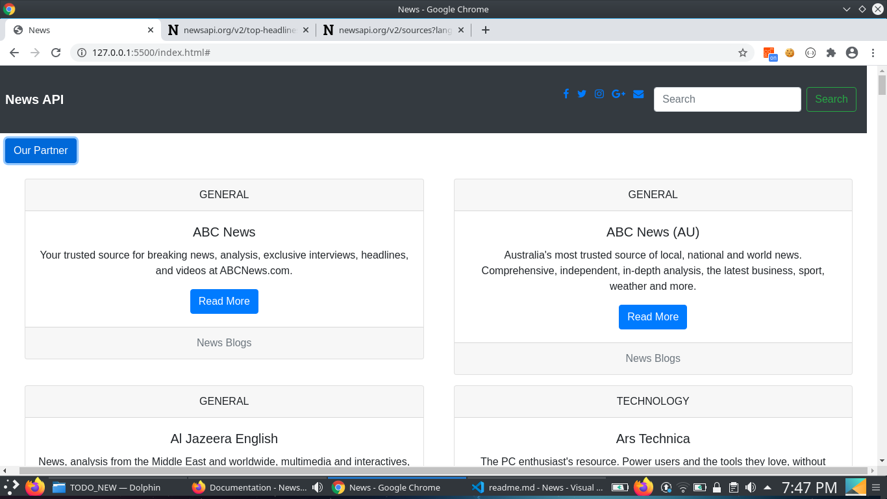

# NewsAPI
 The NewsAPI is a simple and easy to use REST API that returns JSON metadata for headlines currently published from over 30,000 news.

---

**Why News API ?**

- Everything is asynchronously cached for a   super-fast response.
- Jump right into a trial if you're in development.
- Get JSON results with simple HTTP GET requests.

---

### How to start News API ?

- Register at: `https://newsapi.org/`
- Explore Documentation :`https://newsapi.org/docs`

---

### Implementation Of NewsAPI
- 
- 
- 

---
### Technology Used
- HTML
- Css
- Javascript
- Bootstrap Library

## FAQ

- **Is News API is free Services?**
    - Yes,it is totally free for beginner.

---

## Contact Us

Reach out to me at one of the following places!

- Email at <a href="zlite147@gmail.com" target="_blank">`zlite147@gmail.com`</a>

---
